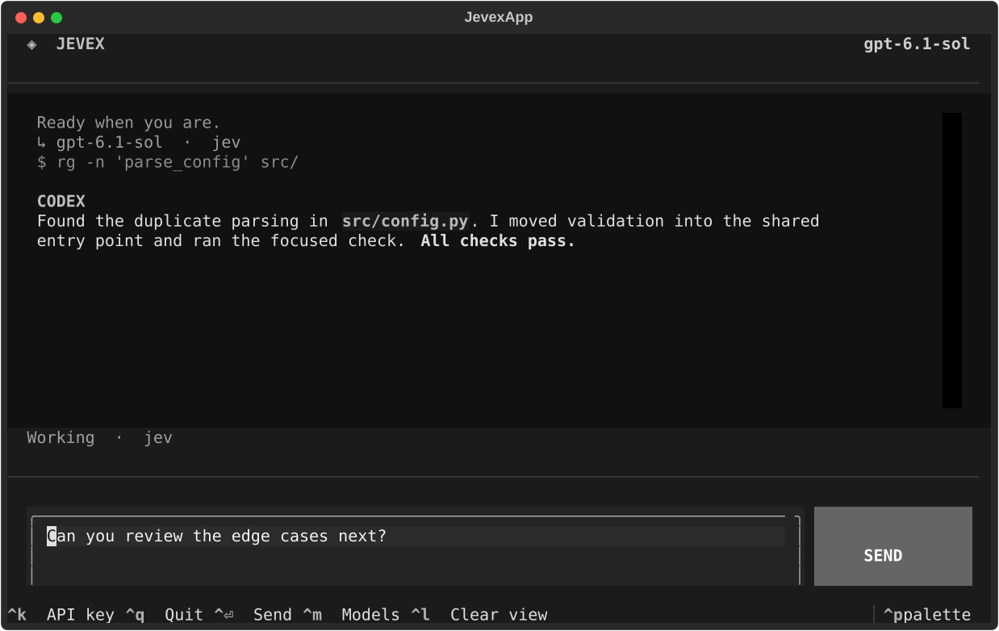

# ◈ Jevex

**One Codex conversation. A fresh model choice for every user turn.**

Jevex is a small terminal wrapper around the official Codex CLI. It asks [Jev](https://docs.typesafe.ai/api) to choose from the models your installed Codex actually lists, then runs that turn with `codex exec`. The next prompt resumes the same Codex session and can use a different model.

<p align="center"></p>

## Why this shape?

```text
your prompt ──▶ Codex model/list ──▶ Jev choice ──▶ codex exec --model …
                                                   │
next prompt ──▶ Codex model/list ──▶ Jev choice ──▶ codex exec resume <same session> --model …
```

No patched Codex binary, local proxy, account-token forwarding, or separate conversation store. Codex handles its own tools, permissions, history, and compaction. Jev sees the first 12,000 characters of the **current** user prompt for routing; Codex receives the complete prompt.

## Install

Requirements: Python 3.10+, [uv](https://docs.astral.sh/uv/getting-started/installation/), the [Codex CLI](https://github.com/openai/codex) installed and signed in, and a [TypeSafe Jev API key](https://docs.typesafe.ai/api).

```bash
uv tool install git+https://github.com/trolloks/jevex-cli.git
jevex
```

The first launch lists all models currently visible to Codex. Keep the ones Jev may choose, then paste your key into the masked prompt. Jevex stores the key at `~/.config/jevex/key` with mode `0600`. Alternatively, set `JEV_API_KEY` in your environment. Run `jevex` from the repository you want Codex to work in; it inherits the current directory and Codex's existing configuration and authentication. If your shell cannot find `jevex`, run `uv tool update-shell` and open a new terminal.

To develop from a checkout instead: `uv tool install .` from the project directory. To update an installed checkout after editing it, run `uv tool install --reinstall .`.

## Use

Run `jevex --stats` to compare cached input and latency for same-model turns and model switches.

| Command | Result |
| --- | --- |
| `jevex` | Open the full-screen TUI. Write a task, press **Ctrl+Enter** or **Send**. |
| `jevex "fix the typo in README"` | Run one turn and print the Codex session ID. |
| `jevex --session <id> "now test it"` | Resume that exact conversation, with a new route. |
| `jevex --dry-run "review this migration"` | Show the selected model without starting a Codex turn. |
| `jevex --model gpt-6.1-sol "review this migration"` | Bypass Jev for one turn; the model must appear in Codex's visible catalog. |

The TUI shows the active route, command activity, and formatted Codex responses. **Ctrl+M** reopens the model picker; **Ctrl+K** changes the Jev key; **Ctrl+L** clears only the visible transcript; **Ctrl+Q** quits. The composer accepts multiple lines.

## What Jevex actually routes

Jevex records each turn's model, previous model, route source, elapsed time, exit code, and Codex-reported token usage in `~/.local/state/jevex/usage.jsonl` (or `$XDG_STATE_HOME/jevex/usage.jsonl`). The file has mode `0600` and contains no prompts, replies, or API keys. `jevex --stats` shows the cached share of input tokens and average latency. It is a diagnostic, not a cost or causal comparison: prompt size, task complexity, and model prices also affect the result. A turn with no usage event has no cache rate.

Jevex asks Jev one typed `choice` question per **user turn**. The choices and their descriptions come from Codex app-server's [`model/list`](https://github.com/openai/codex/blob/main/codex-rs/app-server/README.md), so there is no pinned list of model IDs. On first launch, Jevex saves your exclusions and the model IDs you reviewed. When Codex adds a model, the picker appears once again before automatic routing continues. The catalog is a picker list, **not proof of account entitlement**; a successful Codex turn is the actual check.

If Jev is unavailable, Jevex visibly uses Codex's default model when it is eligible, or the first eligible model. If Codex cannot list models, Jevex stops with an error. An explicit `--model` skips Jev and the exclusions, but still checks the catalog. Jevex never silently substitutes an unknown model returned by Jev.

The choice applies to the whole Codex turn, including its tool continuations. Jevex does **not** reroute each internal model call. Switching models between turns may reduce prompt-cache reuse, but Codex resumes the same conversation and manages compaction. The TUI uses noninteractive `codex exec`, so Codex actions that require an interactive approval may stop rather than opening an approval dialog. There is no measured quality or quota-saving claim here; compare routes on your own tasks before trusting automatic selection.

## Test

```bash
python3 -m unittest -v
jevex --dry-run "explain this function"     # live Jev, if your key is set
jevex --model <a-model-from-your-catalog> "say pong"  # live Codex
```

The unit checks use a mock Jev response; they do not spend API credits. A live Jev decision needs your own key. The TUI test uses Textual's headless test runner.

## Privacy and failure behavior

- Jev receives the current prompt's first 12,000 characters and the visible model names/descriptions. It does not receive the Codex session transcript from Jevex.
- Codex receives your full prompt and manages its normal local session files, authentication, permissions, and network calls.
- Jevex writes no prompt log. The TUI transcript exists in memory while the app is open. The local key file is created with mode `0600`.
- A Jev HTTP error, bad response, or missing key is shown as a fallback reason. A Codex catalog failure stops before sending your prompt to Codex. New models pause automatic one-shot routing until reviewed in the TUI.

## Development

`jevex.py` contains catalog discovery, the one-question Jev request, and the Codex subprocess path. `jevex_tui.py` contains the terminal UI. `test_jevex.py` checks the routing contract, resume command, and UI startup. Keep changes this small unless a real failure requires more machinery.

Licensed under MIT. Jevex is an independent community project, not an OpenAI or TypeSafe product.
